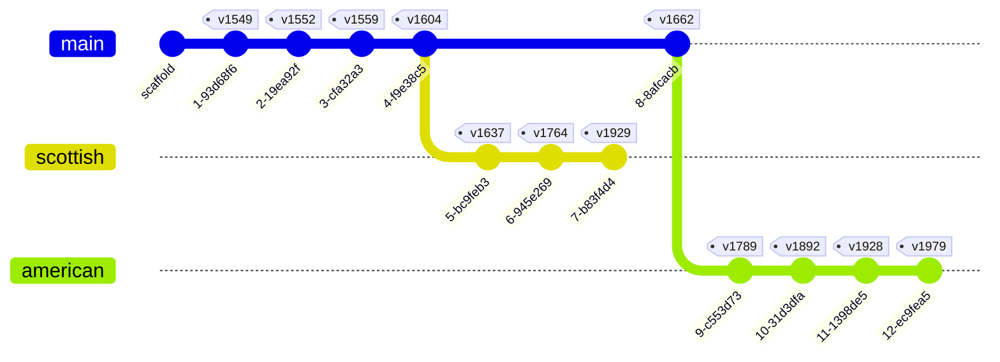

# The Book of Common Prayer, as Git History

**▶ [Read it in the parallel viewer →](https://triblework.github.io/book-of-common-prayer/)** —
compare editions of the prayer book side by side in your browser, with a
GitHub-style diff of exactly what changed. No git required. *(Beta: the viewer
and the texts are still being built and audited.)*

> # 🚧 Work in progress
> **The full texts of the Book of Common Prayer are actively being transcribed
> and added edition by edition — more services are coming soon.** The repository
> structure, tooling, and diff mechanism are complete; today the transcribed
> text covers **Morning Prayer, Evening Prayer, the Litany, and Holy Communion**
> in full across every edition that has them. No
> text is ever invented — everything is sourced from faithful public-domain
> transcriptions (see [`SOURCES.md`](SOURCES.md)). See
> [Transcription status](#transcription-status) for what's here and what's next.

A public, version-controlled edition of the **Book of Common Prayer (BCP)** in
which the historical evolution of the book is expressed as **git history** —
so that anyone can see exactly *what changed* between editions using ordinary
git and GitHub diffs.

## The core idea

The edition axis is **git history, not directories.** There are deliberately no
`/1549/` or `/1662/` folders — that would defeat diffing. Instead:

- Each **edition is a commit** that snapshots the *same* set of files with that
  edition's content, marked with an annotated **tag** (`v1549`, `v1552`, …).
- The tradition **branches** in real history, so we model it with git branches:
  the English line (`main`) forks into the **Scottish** line (from 1604) and the
  **American / Episcopal** line (from 1662). The version graph mirrors the
  actual liturgical genealogy.
- A separate axis — **original spelling vs. modernized spelling** — is a
  *representation* present at every commit, modeled as two parallel trees:
  `texts/original/` (faithful period spelling) and `texts/normalized/`
  (modern spelling, generated from the original by `tools/normalize.py`).

The payoff:

```bash
git diff v1549 v1552 -- texts/normalized/daily-office/morning-prayer.md
```

shows precisely how Morning Prayer changed between 1549 and 1552 — and GitHub's
compare view (`/compare/v1549...v1552`) renders the same thing in the browser.

## Genealogy



*(The Scottish line forks from 1604; the American line forks from 1662. The
American 1789 Communion Office also drew heavily on the Scottish 1764 Office —
see `NOTICE.md`.)*

## Editions

| Year | Line | Branch | Tag | Description |
|-----:|------|--------|-----|-------------|
| 1549 | English | `main` | `v1549` | First Book of Common Prayer (Edward VI). |
| 1552 | English | `main` | `v1552` | Second Edwardian book; adds the penitential introduction to Morning Prayer. |
| 1559 | English | `main` | `v1559` | Elizabethan Settlement. |
| 1604 | English | `main` | `v1604` | Jacobean / Hampton Court revision. |
| 1662 | English | `main` | `v1662` | Restoration; the standard Church of England book. `BCP 1662` |
| 1637 | Scottish | `scottish` | `v1637` | "Laud's Liturgy". |
| 1764 | Scottish | `scottish` | `v1764` | Scottish Communion Office. |
| 1929 | Scottish | `scottish` | `v1929` | Scottish Book of Common Prayer. |
| 1789 | American | `american` | `v1789` | First American book (Protestant Episcopal Church). |
| 1892 | American | `american` | `v1892` | American revision. |
| 1928 | American | `american` | `v1928` | American revision. |
| 1979 | American | `american` | `v1979` | Current American book (public domain). |

## Transcription status

> **🚧 Work in progress.** The full text of every service is actively being
> transcribed and will be added edition by edition — check back soon. The
> repository structure, tooling, and diff mechanism are already complete; the
> text is being filled in against faithful public-domain sources (no text is
> ever invented — see `SOURCES.md`).

The **structure is complete**: all three branches and all twelve tags exist, and
the diff mechanism works end-to-end. The **transcribed text so far** covers the
**Daily Office — Morning Prayer and Evening Prayer — the Litany, Holy
Communion, and the initiation offices (Baptism and Confirmation)** at full Tier-1
depth across every edition that has them — the richest
source of famous edition-to-edition change. Morning/Evening Prayer, the Litany,
and the Christian-initiation offices (Baptism and Confirmation) run across the ten
daily-office editions (English 1549–1662, Scottish 1637,
American 1789–1979); **Holy Communion runs across all twelve** (the Scottish
1764 "Wee Bookie" and 1929 are Communion-only, so they carry only that office).
Holy Communion is where the tradition's most dramatic changes live: the 1549→1552
restructuring, the Gloria in Excelsis moving from an early position to the end,
the words of administration, and the Black Rubric appearing (1552), vanishing
(1559), and returning (1662).

The Christian-initiation offices carry their own famous restructuring: the 1552
book strips the 1549 rite's exorcism, chrisom, and anointing and moves the signing
with the cross to after the baptism; the 1604 book restricts private baptism to a
lawful minister (the Hampton Court change); 1662 adds a distinct Blessing of the
Water and a wholly new office for the Baptism of those of Riper Years; and the
American line folds infant and adult baptism into one rite by 1928. The family is
four separate offices — Public Baptism of Infants, Private Baptism, Baptism of
Those of Riper Years, and Confirmation.

The **pastoral occasional offices** — **Matrimony, the Visitation of the Sick,
the Burial of the Dead, the Churching of Women, and the Commination** — are also
transcribed at full Tier-1. Matrimony, the Visitation of the Sick (with the
Communion of the Sick), and Burial run across the ten daily-office editions;
Churching runs across them too (becoming the 1979 "Thanksgiving for the Birth or
Adoption of a Child"); and the Commination is an English/Scottish office that the
American line **drops** — a clean deletion diff at 1789. The Burial office shows
the tradition's starkest Reformation cut: the 1549 book is a full requiem (a
commendation of the soul, explicit prayers for the dead, an office of psalms, and
a Communion of the dead), and the 1552 book reduces it to the bare graveside form
and rewrites the committal and the prayer to remove prayer for the dead.

The **Catechism** is transcribed at Tier-1 across the editions that carry it
(English 1549–1662, Scottish 1637, American 1789–1979; 1764/1929 are
Communion-only). Its flagship feature is that it **grows**: the pre-1604 text runs
from the baptismal covenant through the Creed, the Ten Commandments, and the Lord's
Prayer, and the 1604 book **adds the whole Sacraments section** ("How many
Sacraments hath Christ ordained…" → Baptism → the Lord's Supper), authorized at the
Hampton Court Conference — a clean insert at `git diff v1559 v1604`. An earlier
growth appears at 1552, which expands the Decalogue to its full scriptural form.
The American line recasts it twice: the 1928 book as the **Offices of Instruction**
(two Offices with prayers and responses), and the 1979 book as **An Outline of the
Faith** (a contemporary commentary on the creeds in question-and-answer form).

The **Ordinal** — the Preface and the services for making Deacons, ordering
Priests, and consecrating Bishops — is transcribed at Tier-1 across the nine
editions that carry it (English 1549–1662, American 1789–1979). It is absent from
the Scottish line: the 1637 book contained no Ordinal, and the 1764/1929 line is
Communion-only. The 1549 node carries the separately-published **1550 Ordinal**
(bound into the book only from 1552). Its flagships are ceremonial and doctrinal:
the **1552 book removes the delivery of instruments** (the "porrection" — the
priest is no longer handed the chalice with bread, and the bishop no longer has the
Bible laid on his neck and the pastoral staff put in his hand); the **1559 book
drops the anti-papal Litany clause** and replaces the Oath of the King's Supremacy
with the Oath of the Queen's Sovereignty; the **1662 book strengthens the forms of
ordination** with the explicit order-naming ("Receive the Holy Ghost *for the
office and work of a Priest/Bishop*…") and adds the episcopal-succession clause to
the Preface; and the **American 1789 book drops the oath entirely**, replacing it
with a Promise of Conformity to the Protestant Episcopal Church.

The **front-matter** — the prefatory prose printed before the services — is
transcribed under `front-matter/`, and its presence is itself the history. The
1549 book's **Preface** ("There was never any thing by the wit of man so well
devised…") is carried forward and, in 1662, **renamed** *Concerning the Service
of the Church*; the 1662 book then adds a wholly **new Preface** ("It hath been
the wisdom of the Church of England…") alongside it. **Of Ceremonies** ("why some
be abolished and some retained") runs from 1549 — where it stood at the *end* of
the book — moving to the *front* in 1552. The **Scottish 1637** book opens with
its own distinct Preface (naming King James and Charles). The **American** line
rewrites the front-matter entirely: it drops *Concerning the Service* and *Of
Ceremonies*, writes its own **Preface** ("It is a most invaluable part of that
blessed liberty…") and adds **The Ratification** of 1789; the 1979 book then
re-adds a modern *Concerning the Service of the Church*.

**Coming soon** (in progress): the Collects, Epistles & Gospels; the Psalter and
lectionary tables will follow. All twelve tags carry sourced text (the earlier
1928/1979 sourcing gaps were closed with clean public-domain sources — see
`SOURCES.md`).

Progress and per-edition provenance are tracked in `SOURCES.md`. Uncertain
readings are flagged inline with `<!-- VERIFY -->` comments and listed there.

## How to explore the diffs

Clone the repository (tags and branches come with it), then:

```bash
# How Morning Prayer changed from 1549 to 1552 (the famous penitential opening):
git diff v1549 v1552 -- texts/normalized/daily-office/morning-prayer.md

# The Holy Communion restructuring of 1552 — the Gloria in Excelsis moves from an
# early position to near the end, and the memorial words of administration change:
git diff v1549 v1552 -- texts/normalized/holy-communion/holy-communion.md

# The Black Rubric (Declaration on Kneeling) appears in 1552, vanishes in 1559,
# and returns in 1662 — visible across three Communion diffs:
git diff v1559 v1662 -- texts/normalized/holy-communion/holy-communion.md

# The baptismal simplification of 1552 — the 1549 rite's exorcism, chrisom, and
# anointing are removed and the signing with the cross moves to after the baptism:
git diff v1549 v1552 -- texts/normalized/occasional-offices/public-baptism.md

# The Reformation stripping of the Burial office in 1552 — the 1549 requiem's
# commendation of the soul, prayers for the dead, office of psalms, and Communion
# of the dead are removed, leaving the bare graveside form:
git diff v1549 v1552 -- texts/normalized/occasional-offices/burial.md

# The American line drops the Commination entirely — a clean deletion at 1789:
git diff v1662 v1789 -- texts/normalized/occasional-offices/commination.md

# The Catechism grows: the 1604 book adds the whole Sacraments section
# ("How many Sacraments hath Christ ordained…" → Baptism → the Lord's Supper),
# authorized at the Hampton Court Conference — a clean insert:
git diff v1559 v1604 -- texts/normalized/occasional-offices/catechism.md

# The Ordinal loses the delivery of instruments in 1552 — the priest is no longer
# handed "the Chalice or cuppe with the breade", only the Bible:
git diff v1549 v1552 -- texts/normalized/ordinal/ordering-priests.md

# The 1662 book strengthens the form of ordination with the explicit order-naming
# ("Receive the Holy Ghost for the office and work of a Priest…"):
git diff v1604 v1662 -- texts/normalized/ordinal/ordering-priests.md

# The American line drops the Oath of the King's Supremacy and replaces it with the
# Promise of Conformity to the Protestant Episcopal Church:
git diff v1662 v1789 -- texts/normalized/ordinal/consecration-bishops.md

# The 1662 book adds a wholly new Preface ("It hath been the wisdom of the Church
# of England…") — a clean insertion of a piece that did not exist before:
git diff v1604 v1662 -- texts/normalized/front-matter/preface.md

# The 1549 Preface is renamed "Concerning the Service of the Church" in 1662
# (the heading changes; the body is modernised and gains three closing directives):
git diff v1604 v1662 -- texts/normalized/front-matter/concerning-the-service.md

# The American line rewrites the whole front-matter at once — its own Preface, a new
# Ratification, and the deletion of Concerning-the-Service and Of Ceremonies:
git diff v1662 v1789 -- texts/normalized/front-matter/

# The 1552 book drops the Introit — the proper psalm the 1549 appointed before
# each Collect — from every Sunday and Holy Day at once:
git diff v1549 v1552 -- texts/normalized/collects-epistles-gospels/advent-1.md

# 1662 adds a Sixth Sunday after the Epiphany, which the earlier books do not have:
git diff v1604 v1662 -- texts/normalized/collects-epistles-gospels/epiphany-6.md

# The 1928 American book re-appoints the Epistle for the Circumcision:
git diff v1892 v1928 -- texts/normalized/collects-epistles-gospels/circumcision.md

# 1979 modernises the Advent 1 Collect and prints a contemporary-language version
# alongside it; its three-year lectionary replaces the single Epistle and Gospel:
git diff v1928 v1979 -- texts/normalized/collects-epistles-gospels/advent-1.md

# Compare any two editions on a shared line, whole tree or one service:
git diff v1552 v1662 -- texts/normalized/daily-office/
```

### The Scottish influence on the American rite

The first American Prayer Book (1789) took its eucharistic prayer not from the
English 1662 book but from the **Scottish Communion Office of 1764** — the
"Wee Bookie" that Samuel Seabury, first bishop of the American church,
undertook to introduce as a condition of his consecration by the Scottish
bishops. The borrowing is inspectable directly, as a cross-branch diff:

```bash
git diff v1764 v1789 -- texts/normalized/holy-communion/holy-communion.md
```

Both retain the Scottish shape of the Great Thanksgiving — the Prayer of
Consecration flowing straight into the Oblation ("**which we now offer unto
thee**") and the Invocation of the Word and Holy Spirit upon the gifts — a
structure the 1662 English rite does not have. The diff shows the American
adaptations (the added Summary of the Law, the fused words of administration,
prayers for civil rulers in place of the King) against that shared Scottish
core. See `NOTICE.md` for the genealogical note.

**Readable word-level diffs.** Set up the suggested local aliases once:

```bash
git config diff.prose.wordRegex '[^[:space:]]'
git config alias.wdiff 'diff --word-diff=color'
git config alias.cdiff 'diff --color-words'
```

Then:

```bash
git wdiff v1552 v1662 -- texts/normalized/daily-office/morning-prayer.md
```

**On GitHub**, use the compare view:

```
https://github.com/triblework/book-of-common-prayer/compare/v1552...v1662
```

## `original/` vs. `normalized/` — which to read

- Use **`texts/normalized/`** to study *substantive* change: modern spelling
  removes noise (`haue`/`have`, `shew`/`show`) so real wording changes stand out
  in a diff.
- Use **`texts/original/`** for *textual fidelity*: it preserves the printed
  spelling of each edition (u/v, i/j, -ie/-y, thorn, doubled consonants), with
  only the long-s and archaic ligatures normalized.

`normalized/` is **generated** from `original/` and is never hand-edited — see
`CONTRIBUTING.md`.

## Provenance and licensing

- The **tooling/code** is under the MIT `LICENSE`.
- The **texts** are governed by **`NOTICE.md`**, not the MIT license. It records
  the public-domain status of every included edition and the Crown-rights
  acknowledgment for 1662: **`BCP 1662`**.
- Per-file sources and retrieval dates are in **`SOURCES.md`**.

## Repository layout

```
texts/
  original/     # faithful transcription (period spelling)  -- generated by the builder
  normalized/   # generated modern spelling (do not hand-edit)
tools/
  build_history.py          # replay the whole edition graph (history as a build artifact)
  scrape.py                 # fetch + clean source HTML -> markdown (assistive)
  sentence_split.py         # enforce one-unit-per-line semantic line breaks
  normalize.py              # original/ -> normalized/ via the rules below
  normalization_rules.yaml  # transparent, version-controlled spelling rules
  verify_index.py           # keep inline VERIFY comments in sync with provenance
```

**History is a build artifact.** The published branches and tags you see here are
*outputs*. The source of truth is the orphan **`authoring`** branch (per-edition
text in `editions/`, the genealogy in `editions.yaml`, provenance in
`provenance.yaml`); `tools/build_history.py` deterministically regenerates the
whole `main`/`scottish`/`american` graph and all `vYYYY` tags from it. This is why
completing a service in an *early* edition can change that edition's commit so its
diff renders a real liturgical change. See `CONTRIBUTING.md`. SHAs are not part of
the interface — tags and diffs are.

## Contributing

See **`CONTRIBUTING.md`**. The one rule to internalize: **editions are commits
and tags on the right branch — never per-edition directories** — and never
hand-edit `texts/normalized/`.
